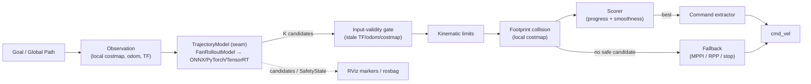
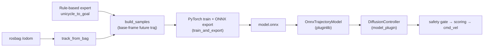
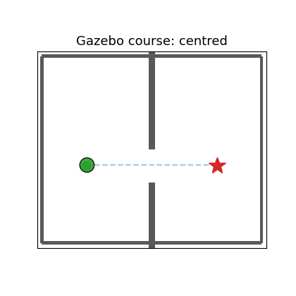

  

<em>Real pipeline output: the generative model proposes multimodal candidates, the footprint safety layer rejects the ones (red lines) that enter the obstacle inflation band (red region), and the scorer picks the best candidate (green) — avoiding the obstacle while keeping clearance.</em>

# nav2_experimental_planner

**A Generative Navigation Framework for Nav2**

> Learned models propose. Classical safety disposes. Nav2 executes.

`nav2_experimental_planner` is not a project that replaces Nav2. It is an OSS foundation that makes the most of Nav2's existing architecture (Behavior Tree / Lifecycle Node / Planner & Controller plugins / Costmap / Collision Monitor) and, on top of it, **safely connects generative navigation models** from the Diffusion / Flow Matching / Consistency / Transformer / World-Model families.

In addition, it experimentally collects **planners absent from upstream Nav2 — not only generative ones, but classical ones too.** As classical planners Nav2 does not ship, it implements, each as a `nav2_core::GlobalPlanner`: the **sampling-based** **RRT\*** (asymptotically optimal) and **RRT-Connect** (bidirectional, fast in narrow passages) in [nav2_rrt_planner](classical_planners/nav2_rrt_planner), **PRM** (Probabilistic Roadmap) in [nav2_prm_planner](classical_planners/nav2_prm_planner), the **incremental-search** **D\* Lite** (repairs only changed cells to cut replanning cost) in [nav2_dstar_lite_planner](classical_planners/nav2_dstar_lite_planner), the **grid-search speed-up** **JPS** (Jump Point Search, prunes symmetry to accelerate A\*) in [nav2_jps_planner](classical_planners/nav2_jps_planner), the **any-angle** **Lazy Theta\*** (straight-line paths not bound to grid directions, with lazy line-of-sight checks) in [nav2_lazy_theta_star_planner](classical_planners/nav2_lazy_theta_star_planner), the **anytime** **ARA\*** (progressively improves a bounded-suboptimal solution within a time budget) in [nav2_ara_star_planner](classical_planners/nav2_ara_star_planner), and the **geometric (continuous-space)** **visibility graph** (exact shortest straight-line path connecting obstacle convex corners) in [nav2_visibility_graph_planner](classical_planners/nav2_visibility_graph_planner). An offline table comparing these 8 on shared scenarios is in [docs/planner_comparison.md](docs/planner_comparison.md) (reproducible with `nav2_planner_benchmarks`). On the controller (local) side there are also 2 reactive avoidance controllers absent from Nav2: **VFH+** (Vector Field Histogram Plus, steers toward free valleys via a polar histogram) in [nav2_vfh_controller](reactive_controllers/nav2_vfh_controller) and **ND** (Nearness Diagram, gap selection + safety bias to keep to the corridor center) in [nav2_nd_controller](reactive_controllers/nav2_nd_controller), both as `nav2_core::Controller`.

- **Scope:** AMR / Delivery Robot / Warehouse Robot / Service Robot
- **Out of Scope:** Manipulation, MoveIt, Humanoid, Full VLA, Multi-Agent Planning (not primary goals)
- **Core Positioning:** A Nav2-native Generative Navigation Framework

---

## Why this project

Nav2 is the de-facto practical foundation for ROS 2 mobile-robot development, with powerful stacks like Smac Planner / Regulated Pure Pursuit / MPPI. At the same time, because it relies on hand-designed costs, local optimization, and heuristics, limits tend to surface in areas such as crowds, narrow passages, dynamic obstacles, social navigation, sensor noise, and tuning burden.

This project addresses that not as a "Nav2 replacement" but as a **"Nav2 capability extension"**: a generative model proposes multimodal future-trajectory candidates, a deterministic safety layer validates them, and Nav2 executes.

See [docs/architecture.md](docs/architecture.md) §1 (Problem Statement) / §2 (Vision) / §15 (Why This OSS Can Win) for details.

---

## Design philosophy

| Principle | Meaning |
|---|---|
| Learned models propose | The generative model is a generator of candidate trajectories, not a safety arbiter |
| Classical safety disposes | Costmap / footprint / velocity limits / Collision Monitor reject candidates |
| Nav2 executes | The existing operational foundation (BT / Lifecycle / Controller Server) executes |

### Non-Negotiable Architecture Rules

1. A neural model must never publish `cmd_vel` directly (it must always pass through the Safety Gate and Command Extractor).
2. Do not fork Nav2 (achieve everything via integration with Plugin / BT / Lifecycle / Costmap / Collision Monitor).
3. Treat Costmap / TF / Odometry as the runtime truth source.
4. Every candidate trajectory is visualizable and recordable (explainable via RViz + rosbag).
5. If the GPU dies, the robot safely stops or falls back.
6. The camera is optional (AMR / warehouse / delivery setups are often LiDAR + costmap).
7. Models in the Model Zoo must have passed the benchmark.

---

## Final Architecture Position

The correct initial form of `nav2_experimental_planner` is this:

> **A costmap-conditioned generative trajectory proposal framework that runs as a Nav2 Controller Plugin.**

The final form is a Nav2-native Generative Navigation Framework able to integrate Diffusion / Flow Matching / Consistency Models / Transformer Planners / World Models.

What must be built first is not "a SOTA model" but the following:

- A plugin structure that fits naturally into Nav2
- A common representation of Future Trajectory Candidates
- A Safety Gate
- An MPPI / RPP fallback
- RViz visualization / rosbag replay
- A benchmark suite
- Model manifest / model card
- A training pipeline
- A Jetson deployment path

---

## Architecture diagrams

The pipeline where a generative model proposes, a deterministic safety layer validates, and Nav2 executes (Controller Plugin / Mode A):

> **Learned models propose. Classical safety disposes. Nav2 executes.**
> Even if you swap the learned model (behind `TrajectoryModel`), the safety layer, scoring, fallback, and visualization are reused unchanged.

One full loop from data generation to execution (each stage unit-tested):

## Costmap-conditioned generation (an OSS-gap implementation)

  

<em>Output of the shipped model <code>CostmapFlowPlanner</code> (flow matching + egocentric costmap encoder) itself. As the obstacle (red) moves left/right, the generated candidate trajectories veer to the opposite side — i.e. it has learned costmap-conditioned avoidance. Reproduce with <a href="tools/costmap_demo.py">tools/costmap_demo.py</a>.</em>

A survey (cross-checking papers against existing OSS) confirmed that **for Nav2 ground robots there is no public implementation of flow / diffusion / consistency / transformer / recurrent local planners**, so this repo ships 5 families + costmap conditioning as an OSS-gap implementation ([docs/model_zoo.md](docs/model_zoo.md)). The transformer is a DETR-style set-prediction (K learned query tokens cross-attend to costmap+context tokens and each decodes a trajectory in one shot — a deterministic single forward pass, no noise sampling); the recurrent one is a GRU autoregressive rollout (conditioned on costmap+context, it emits the trajectory one step at a time, feeding the previous step back in — a world-model-like sequential bias). Both differ clearly in behavior from the other families. An **offline leaderboard comparing 10 configurations on shared scenarios** cross-compares the costmap-conditioned models — [docs/model_comparison.md](docs/model_comparison.md) (reproducible with `tools/benchmark_models.py`).

## Generative GlobalPlanner (Mode B)

  

<em>The shipped model <code>PathFlowPlanner</code> (flow matching) generates start→goal global path candidates, the deterministic costmap-validity layer rejects the ones that hit obstacles (red), and the shortest safe path (green) is selected — a propose→validate→select pipeline. As the obstacle moves left/right, the selected path switches to the opposite side. Reproduce with <a href="tools/mode_b_demo.py">tools/mode_b_demo.py</a>, or record the same pipeline to an MCAP and open it in <strong>Foxglove Studio</strong> (3D panel, scrub/play, Export → Video) with <a href="tools/foxglove_mcap_demo.py">tools/foxglove_mcap_demo.py</a> → <a href="docs/mode_b_demo.mcap">docs/mode_b_demo.mcap</a> (see <a href="docs/visualization.md">docs/visualization.md</a>).</em>

This is the **Nav2 GlobalPlanner (Mode B)**, symmetric to the local controller (Mode A). No OSS integrating a generative model into `nav2_core::GlobalPlanner` existed at survey time, so it is implemented as a `PathModel` seam (analytic `FanPathModel` / learned `OnnxPathModel`, with costmap conditioning on the same seam) ([nav2_diffusion_global_planner](generative/nav2_diffusion_global_planner)). Like Mode A, learned Mode B ships **3 families — flow / transformer / recurrent (GRU autoregressive rollout) —** in `model_zoo`. **The transformer aims proposals at an off-centre slot via token attention, and by training with a footprint-aware (validator-aware) loss it is the first Mode B model to thread the footprint-validated *off-centre gap* purely generatively** (verified in the real C++ benchmark across 8 courses, no fallback). A small transformer over-aimed and missed the dead-ahead gaps (a real trade-off), but **raising its capacity (dim 64 / 8 heads / 3 blocks) and tri-mixing dead-ahead training samples closed it** — the shipped model now threads **both** the off-centre gap **and** the dead-ahead *centred* / *narrow* / *double gate* gaps (off-centre remains transformer-only; flow / recurrent solve only the dead-ahead ones). The remaining bounds — *far off-centre gap* (off-axis slot ~3 m forward) and *slalom* — are hybrid territory. Cross-comparison is in [docs/planner_comparison.md](docs/planner_comparison.md); where it works and where it hits a ceiling is in [docs/generative_limits.md](docs/generative_limits.md).

## Closed-loop Gazebo courses (Mode A + B)

  

<em>The obstacle courses shipped in <a href="nav2_diffusion_sim">nav2_diffusion_sim</a>, mirroring the off-line <code>planner_benchmark</code> scenarios. Each course is generated from a <strong>single spec</strong> into three consistent artifacts — a gz-sim world, a matching occupancy map, and the mission goals — so the world, map, and goals cannot drift. The figure shows the generated course layouts with a valid start→goal route (grid A\* on the course occupancy grid). Reproduce with <a href="tools/gazebo_courses_demo.py">tools/gazebo_courses_demo.py</a>.</em>

Drive a course closed-loop on a real ROS host with
`ros2 launch nav2_diffusion_sim tb3_gazebo_course.launch.py course:=gap` — it loads
the world + map, spawns TB3 at the start, brings up Nav2 with the
`DiffusionController`, runs the mission, and writes a Markdown leaderboard. The
course **assets and geometry are generated and unit-tested in-tree**; the
closed-loop *numbers* require a real ROS host (the dev sandbox blocks inter-process
DDS), so none are fabricated here — see [docs/simulation.md](docs/simulation.md)
section 10.5.

## Documentation map

| Document | Contents |
|---|---|
| [docs/architecture.md](docs/architecture.md) | Core architecture (Problem / Vision / 5-layer structure / Data Flow / Plugin / Inference / Repo structure / Why Win) |
| [docs/safety.md](docs/safety.md) | Safety architecture (safety layer / state machine / fallback / safety deliverables) |
| [docs/training.md](docs/training.md) | Training architecture (data collection / dataset schema / objective / sim-to-real) |
| [docs/benchmarking.md](docs/benchmarking.md) | Benchmark suite (baseline / scenario / metrics / leaderboard) |
| [docs/simulation.md](docs/simulation.md) | Simulation strategy (Gazebo / Isaac Sim / golden scenarios) |
| [docs/deployment.md](docs/deployment.md) | Deployment strategy (platform / Jetson / packaging / staged rollout) |
| [docs/roadmap.md](docs/roadmap.md) | Roadmap (v0.1 / v0.5 / v1.0 / v2.0) |
| [docs/next_phase.md](docs/next_phase.md) | Next-phase execution plan (an actionable design doc with assumptions, steps, and completion criteria for data/environment-dependent progress) |
| [docs/risks.md](docs/risks.md) | Risks (technical / OSS operation / safety & liability) |
| [docs/getting_started.md](docs/getting_started.md) | Onboarding for Nav2 users (swapping in the Controller / demo) |
| [docs/contributing.md](docs/contributing.md) | Contribution guide (adding a plugin / model / benchmark) |
| [docs/model_zoo.md](docs/model_zoo.md) | Model Zoo (model card / manifest index) |
| [docs/model_comparison.md](docs/model_comparison.md) | Offline comparison leaderboard of 10 generative configs (auto-generated by `tools/benchmark_models.py`) |
| [docs/planner_comparison.md](docs/planner_comparison.md) | Offline comparison of 8 classical GlobalPlanners (path length / poses / time; auto-generated by `nav2_planner_benchmarks`) |
| [docs/controller_comparison.md](docs/controller_comparison.md) | Closed-loop comparison of reactive Controllers (VFH+ / ND) (reach / clearance / steering / centering; auto-generated by `nav2_planner_benchmarks`) |
| [docs/choosing_a_planner.md](docs/choosing_a_planner.md) | Planner / controller selection guide (situational recommendations / decision flow) |
| [docs/generative_limits.md](docs/generative_limits.md) | Where generative models work and where they hit a ceiling (an empirical note: what works, where classical wins, and the path to surpass it) |
| [docs/visualization.md](docs/visualization.md) | RViz / Foxglove visualization (candidate trajectories / safety state / cmd_vel; Foxglove layout included) |

---

## Status

**v0.11.0** — **the Mode B transformer threads off-centre *and* dead-ahead gaps, plus portable visualization.** Raising the transformer's capacity (dim 64 / 8 heads / 3 decoder blocks) and tri-mixing dead-ahead training samples **closes the over-aim trade-off**: the shipped model now threads the footprint-validated **off-centre gap** *and* the **dead-ahead gaps** (*centred* / *narrow* / *double gate*), plus *clear* / *side obstacle* — verified in the real C++ `planner_benchmark` (8 courses) with the onnx C++ gtests green. (Getting there was honest research: an 8-course sweep first exposed the trade-off; a same-capacity data rebalance only *shifted* it; capacity closed it. The remaining bounds — *far off-centre gap* and *slalom* — stay hybrid territory.) For visualization without a live ROS graph, the real Mode B pipeline is recorded to an **MCAP** openable in the **Foxglove web/desktop app**, and the closed-loop Gazebo obstacle courses render to a **GIF**. The sandbox "no live ROS" limit was root-caused to the agent's command sandbox (DDS discovery — not the machine, ROS, or this project), and the Gazebo mission harness hardened. The foundation is v0.10.0 (footprint-clearance loss breaks the off-centre-gap ceiling; 8-course benchmark; single-source Gazebo courses; package reorg; CI restored in a `ros:jazzy` container; README in English), v0.9.0 (generative-family expansion — transformer + recurrent on both seams), v0.8.0 (tightly-coupled guided hybrid + DAgger), v0.7.0 (loosely-coupled hybrid, all scenarios in both modes), v0.6.0 (the first learned models end-to-end in C++ ONNX, [model_zoo](model_zoo)), v0.5.0 (ND + comparison benchmarks + selection guide), v0.4.0 (**8 classical GlobalPlanners** + VFH+), and the generative stack through v0.3.0 (deterministic safety layer + ONNX + flow/diffusion/consistency + costmap conditioning + training pipeline + RViz/Foxglove). See [CHANGELOG.md](CHANGELOG.md) for history and [docs/roadmap.md](docs/roadmap.md) for plans. The API is not stabilized until 1.0.0.

> ⚠️ This OSS is not a safety-certified product. Anyone deploying on real hardware must implement a hardware E-stop, speed limits, an ODD (Operational Design Domain) definition, and an on-site risk assessment. See [docs/safety.md](docs/safety.md).
