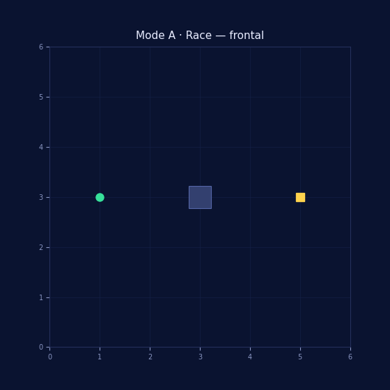
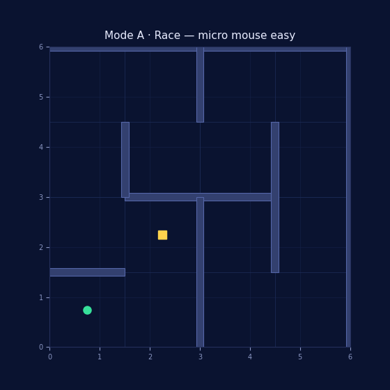
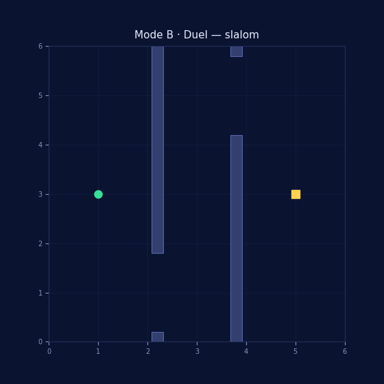
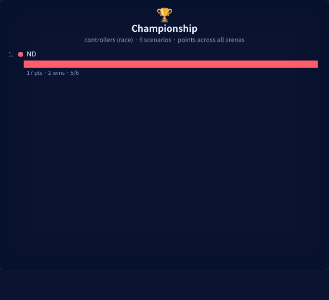
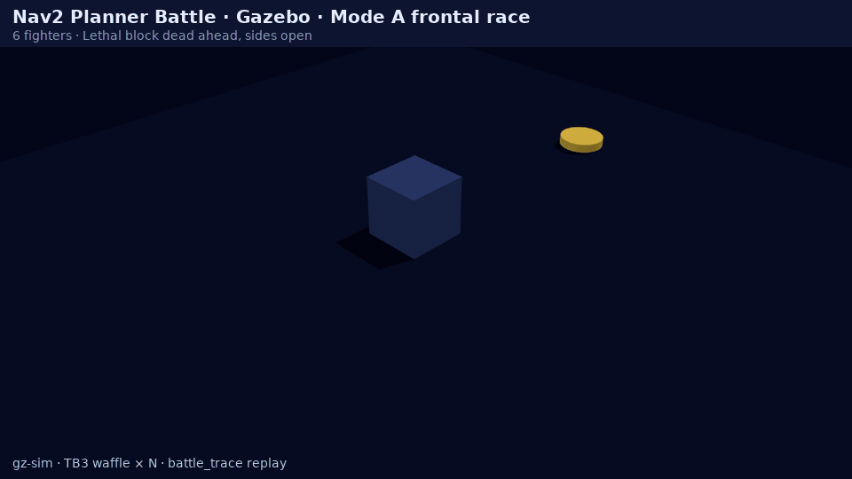
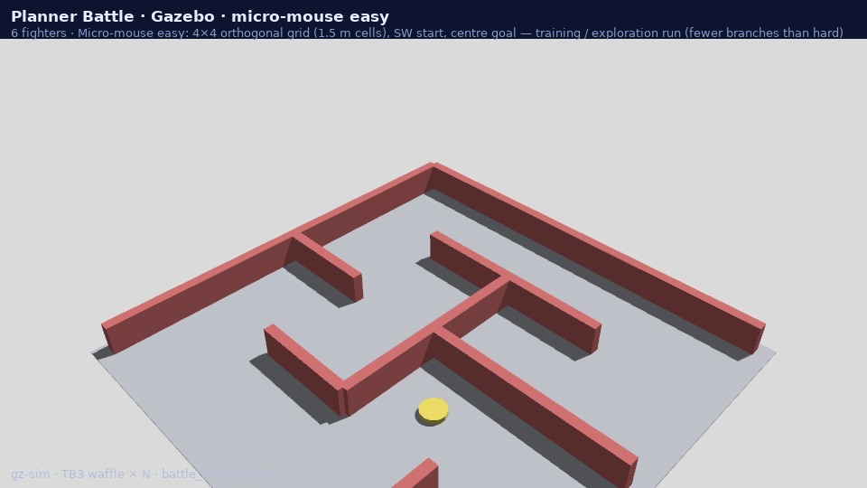
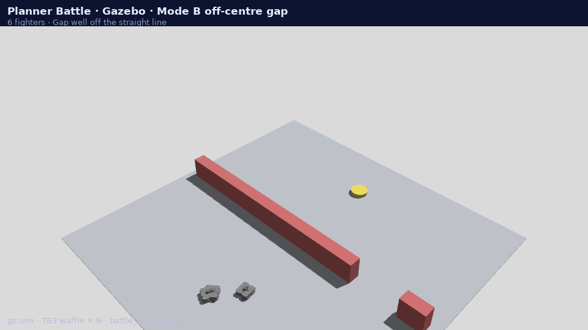
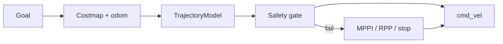

# Nav2PlannerBattle ⚔️

**Real Nav2 planners & controllers, head-to-head — browser + benchmarks.**

> Learned models propose. Classical safety disposes. Nav2 executes.

  

<strong><a href="https://rsasaki0109.github.io/Nav2PlannerBattle/">▶ Play online</a></strong> · no install · real <code>battle_trace</code> plugins

  
  &nbsp;
  

  

<strong>Gazebo replay</strong> · multiple TurtleBot3 · same <code>battle_trace</code> paths

  
  &nbsp;
  

  

---

## Planner Battle

| Mode | What | Play |
|---|---|---|
| **🏁 Race** | Controllers race to goal (VFH+, ND, learned, threading, …) | [frontal](https://rsasaki0109.github.io/Nav2PlannerBattle/?m=A&s=1) · [maze](https://rsasaki0109.github.io/Nav2PlannerBattle/?m=A&s=4) |
| **🧭 Duel** | Global planners draw paths (RRT*, JPS, Diffusion, omni/diff/Ackermann, …) | [slalom](https://rsasaki0109.github.io/Nav2PlannerBattle/?m=B&s=6) · [kinematics gap](https://rsasaki0109.github.io/Nav2PlannerBattle/?m=B&s=3) · [hard maze](https://rsasaki0109.github.io/Nav2PlannerBattle/?m=B&s=9) |
| **🏆 Championship** | Points across all scenarios | [Race](https://rsasaki0109.github.io/Nav2PlannerBattle/?m=C) · [Duel](https://rsasaki0109.github.io/Nav2PlannerBattle/?m=C&sub=B) |

Real `nav2_core` plugins — no scripted winners. Traces: `ros2 run nav2_planner_benchmarks battle_trace` · browser GIFs: [`tools/record_battle_gif.py`](tools/record_battle_gif.py) · Gazebo GIFs: [`tools/record_battle_gazebo_gif.py`](tools/record_battle_gazebo_gif.py) · **your ONNX:** [`docs/custom_model_battle.md`](docs/custom_model_battle.md)

---

## What is this?

Nav2 extension — **not** a replacement. Generative models propose trajectories/paths; a deterministic safety layer validates; Nav2 executes via standard plugins.

| | |
|---|---|
| **Adds** | 8 classical GlobalPlanners, VFH+/ND controllers, generative Mode A/B models |
| **Scope** | AMR / warehouse / delivery |
| **Compare** | [planners](docs/planner_comparison.md) · [controllers](docs/controller_comparison.md) · [models](docs/model_comparison.md) |

Details: [architecture](docs/architecture.md) · [safety](docs/safety.md) · [getting started](docs/getting_started.md)

---

## Architecture

Rules: models never publish `cmd_vel` directly · no Nav2 fork · GPU failure → stop/fallback. Full spec: [architecture.md](docs/architecture.md) · [safety.md](docs/safety.md)

---

## Demos

  
  &nbsp;
  

| Demo | Script |
|---|---|
| Costmap-conditioned flow | [`tools/costmap_demo.py`](tools/costmap_demo.py) |
| Mode B propose→validate | [`tools/mode_b_demo.py`](tools/mode_b_demo.py) |
| Gazebo courses | [`nav2_diffusion_sim`](generative/nav2_diffusion_sim) · [`docs/simulation.md`](docs/simulation.md) |

Mode B global planner: [nav2_diffusion_global_planner](generative/nav2_diffusion_global_planner) · limits & ceilings: [generative_limits.md](docs/generative_limits.md)

---

## Docs

| Topic | Link |
|---|---|
| Training | [docs/training.md](docs/training.md) |
| Benchmarks | [docs/benchmarking.md](docs/benchmarking.md) |
| Model zoo | [docs/model_zoo.md](docs/model_zoo.md) |
| Visualization | [docs/visualization.md](docs/visualization.md) |
| Roadmap | [docs/roadmap.md](docs/roadmap.md) · [plan.md](plan.md) · [CHANGELOG.md](CHANGELOG.md) |
| Pick a planner | [docs/choosing_a_planner.md](docs/choosing_a_planner.md) |
| Battle your model | [docs/custom_model_battle.md](docs/custom_model_battle.md) |

---

## Status

**v0.11.0** — Mode B transformer threads gaps; MCAP/Foxglove viz; Gazebo courses. API unstable until 1.0.0.

> ⚠️ Not safety-certified. Real hardware needs E-stop, speed limits, ODD, on-site risk assessment. [safety.md](docs/safety.md)
