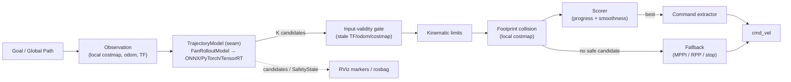
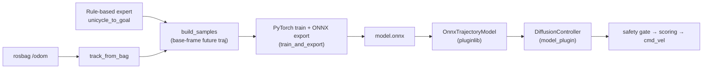
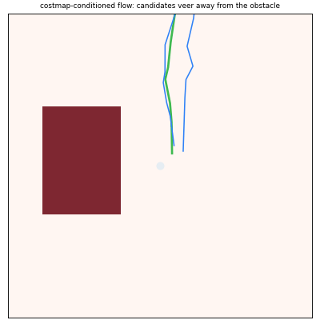

  

<em>実際のパイプライン出力: 生成モデルが multimodal 候補を提案し、footprint 安全層が障害物 inflation 帯（赤い領域）に入る候補（赤線）を棄却し、scorer が最良候補（緑）を選んでクリアランスを保ちつつ回避。</em>

# nav2_experimental_planner

**Nav2向け Generative Navigation Framework**

> Learned models propose. Classical safety disposes. Nav2 executes.
> （生成モデルは候補を出す。安全層は候補を落とす。Nav2 は実行する。）

`nav2_experimental_planner` は Nav2 を置き換えるプロジェクトではありません。Nav2 の既存アーキテクチャ（Behavior Tree / Lifecycle Node / Planner・Controller Plugin / Costmap / Collision Monitor）を最大限活かしたうえで、その上に **Diffusion / Flow Matching / Consistency / Transformer / World Model 系の生成型ナビゲーションモデルを安全に接続する** ための OSS 基盤です。

加えて、**Nav2 公式に無い planner（生成型に限らず classical も）** を実験的に収録します。Nav2 がもたない classical planner として、**サンプリングベース**の **RRT\***（asymptotically optimal）と **RRT-Connect**（双方向・狭路で高速）を [nav2_rrt_planner](nav2_rrt_planner) に、**PRM**（Probabilistic Roadmap）を [nav2_prm_planner](nav2_prm_planner) に、**インクリメンタル探索**の **D\* Lite**（変化セルだけ修復し再計画コストを抑える）を [nav2_dstar_lite_planner](nav2_dstar_lite_planner) に、**グリッド探索高速化**の **JPS**（Jump Point Search、対称性枝刈りで A\* を高速化）を [nav2_jps_planner](nav2_jps_planner) に、**any-angle** の **Lazy Theta\***（グリッド方向に縛られない直線経路、LOS 判定を遅延）を [nav2_lazy_theta_star_planner](nav2_lazy_theta_star_planner) に、**anytime** の **ARA\***（時間予算内で bounded-suboptimal な解を漸進改善）を [nav2_ara_star_planner](nav2_ara_star_planner) に、**幾何（連続空間）**の **visibility graph**（障害物の凸コーナーを結ぶ厳密な直線最短）を [nav2_visibility_graph_planner](nav2_visibility_graph_planner) に、それぞれ nav2_core::GlobalPlanner として実装済み。これら 8 種を同一シナリオで比較したオフライン表は [docs/planner_comparison.md](docs/planner_comparison.md)（`nav2_planner_benchmarks` で再現可能）。Controller（局所）側にも、Nav2 に無い反応的回避コントローラを 2 種実装済み: **VFH+**（Vector Field Histogram Plus、極座標ヒストグラムで free valley へ操舵）を [nav2_vfh_controller](nav2_vfh_controller)、**ND**（Nearness Diagram、gap 選択 + 安全偏向で回廊中央寄せ）を [nav2_nd_controller](nav2_nd_controller) として、いずれも nav2_core::Controller で。

- **Scope:** AMR / Delivery Robot / Warehouse Robot / Service Robot
- **Out of Scope:** Manipulation, MoveIt, Humanoid, Full VLA, Multi-Agent Planning（主目的としては扱わない）
- **Core Positioning:** Nav2 Native な Generative Navigation Framework

---

## なぜこの OSS か

Nav2 は ROS 2 移動ロボット開発の事実上の実用基盤であり、Smac Planner / Regulated Pure Pursuit / MPPI など強力なスタックを持ちます。一方で、手設計のコスト・局所最適化・ヒューリスティックに依存するため、人混み・狭路・動的障害物・社会的ナビゲーション・センサーノイズ・チューニング負荷といった領域で限界が出やすい領域があります。

本 OSS はこれを「Nav2 の代替」ではなく **「Nav2 の能力拡張」** として解きます。生成モデルが multimodal な未来軌道候補を提案し、決定論的な安全層が検証し、Nav2 が実行する構造です。

詳細は [docs/architecture.md](docs/architecture.md) の §1（Problem Statement）/ §2（Vision）/ §15（Why This OSS Can Win）を参照してください。

---

## 設計哲学

| 原則 | 内容 |
|---|---|
| Learned models propose | 生成モデルは候補軌道の生成器であり、安全判定器ではない |
| Classical safety disposes | Costmap / footprint / 速度制約 / Collision Monitor が候補を棄却する |
| Nav2 executes | 既存の運用基盤（BT / Lifecycle / Controller Server）が実行する |

### Non-Negotiable Architecture Rules

1. Neural model が直接 `cmd_vel` を publish してはならない（必ず Safety Gate と Command Extractor を通す）。
2. Nav2 を fork しない（Plugin / BT / Lifecycle / Costmap / Collision Monitor との統合で実現する）。
3. Costmap / TF / Odometry を runtime truth source として扱う。
4. すべての候補軌道は可視化・記録できる（RViz + rosbag で説明可能）。
5. GPU が死んでもロボットは安全に止まるか fallback する。
6. Camera は optional（AMR / warehouse / delivery は LiDAR + costmap 構成が多い）。
7. Model Zoo のモデルは benchmark 通過済みでなければならない。

---

## Final Architecture Position

`nav2_experimental_planner` の正しい初期形は次です。

> **Nav2 Controller Plugin として動く、costmap-conditioned generative trajectory proposal framework。**

最終形は、Diffusion / Flow Matching / Consistency Models / Transformer Planners / World Models を統合できる、Nav2 Native な Generative Navigation Framework です。

最初に作るべきものは「SOTA モデル」ではなく、以下です。

- Nav2 に自然に入る plugin 構造
- Future Trajectory Candidates の共通表現
- Safety Gate
- MPPI / RPP fallback
- RViz 可視化 / rosbag replay
- benchmark suite
- model manifest / model card
- training pipeline
- Jetson deployment path

---

## アーキテクチャ図

生成モデルが提案し、決定論的安全層が検証し、Nav2 が実行するパイプライン（Controller Plugin / Mode A）:

> **Learned models propose. Classical safety disposes. Nav2 executes.**
> 学習モデル（`TrajectoryModel` の裏）を差し替えても、安全層・scoring・fallback・可視化はそのまま再利用できます。

データ生成から実行までの一周（各段ユニットテスト済み）:

## costmap 条件付き生成（OSS-gap 実装）

  

<em>出荷モデル <code>CostmapFlowPlanner</code>（flow matching + egocentric costmap エンコーダ）そのものの出力。障害物（赤）が左右に動くと、生成された候補軌道が反対側へ veer する＝ costmap に条件付いた回避を学習している。再現は <a href="tools/costmap_demo.py">tools/costmap_demo.py</a>。</em>

調査（papers＋既存 OSS の突き合わせ）の結果、Nav2 地上ロボット向けの **flow / diffusion / consistency の local planner で公開実装が無い** ことを確認し、3系統＋costmap 条件付けを OSS-gap 実装として収録している（[docs/model_zoo.md](docs/model_zoo.md)）。6系統を同一シナリオで比較したオフライン leaderboard は [docs/model_comparison.md](docs/model_comparison.md)（`tools/benchmark_models.py` で再現可能）。

## 生成型 GlobalPlanner（Mode B）

  

<em>出荷モデル <code>PathFlowPlanner</code>（flow matching）が start→goal の大域パス候補を生成し、決定論的 costmap 検証層が障害物に当たる候補（赤）を棄却、最短の安全パス（緑）を選択する propose→validate→select パイプライン。障害物が左右に動くと選択パスが反対側へ切り替わる。再現は <a href="tools/mode_b_demo.py">tools/mode_b_demo.py</a>。</em>

これは local controller（Mode A）と対称の **Nav2 GlobalPlanner（Mode B）**。生成型モデルを `nav2_core::GlobalPlanner` に統合した OSS は調査時点で存在せず、`PathModel` seam（analytic `FanPathModel` / 学習済み `OnnxPathModel`、costmap 条件付きも同 seam）として実装している（[nav2_diffusion_global_planner](nav2_diffusion_global_planner)）。

## ドキュメント地図

| ドキュメント | 内容 |
|---|---|
| [docs/architecture.md](docs/architecture.md) | コアアーキテクチャ（Problem / Vision / 5層構成 / Data Flow / Plugin / Inference / Repo 構造 / Why Win） |
| [docs/safety.md](docs/safety.md) | Safety Architecture（安全層 / 状態機械 / fallback / 安全 deliverables） |
| [docs/training.md](docs/training.md) | Training Architecture（データ収集 / dataset schema / objective / sim-to-real） |
| [docs/benchmarking.md](docs/benchmarking.md) | Benchmark Suite（baseline / scenario / metrics / leaderboard） |
| [docs/simulation.md](docs/simulation.md) | Simulation Strategy（Gazebo / Isaac Sim / golden scenarios） |
| [docs/deployment.md](docs/deployment.md) | Deployment Strategy（platform / Jetson / packaging / staged rollout） |
| [docs/roadmap.md](docs/roadmap.md) | Roadmap（v0.1 / v0.5 / v1.0 / v2.0） |
| [docs/risks.md](docs/risks.md) | Risks（technical / OSS operation / safety・liability） |
| [docs/getting_started.md](docs/getting_started.md) | Nav2 ユーザー向け導入（Controller 差し替え / demo） |
| [docs/contributing.md](docs/contributing.md) | 貢献ガイド（plugin / model / benchmark 追加） |
| [docs/model_zoo.md](docs/model_zoo.md) | Model Zoo（model card / manifest 一覧） |
| [docs/model_comparison.md](docs/model_comparison.md) | 6生成系のオフライン比較 leaderboard（`tools/benchmark_models.py` 自動生成） |
| [docs/planner_comparison.md](docs/planner_comparison.md) | classical GlobalPlanner 8種のオフライン比較（経路長/pose/時間。`nav2_planner_benchmarks` 自動生成） |
| [docs/controller_comparison.md](docs/controller_comparison.md) | reactive Controller（VFH+ / ND）の閉ループ比較（到達/クリアランス/操舵/中央寄せ。`nav2_planner_benchmarks` 自動生成） |
| [docs/choosing_a_planner.md](docs/choosing_a_planner.md) | planner / controller 選択ガイド（状況別の推奨・決定フロー） |
| [docs/visualization.md](docs/visualization.md) | RViz / Foxglove 可視化（候補軌道・安全状態・cmd_vel、Foxglove レイアウト同梱） |

---

## Status

**v0.5.0** — 実験的カタログを**使えるものにする**リリース。v0.4.0 の classical planner 群に加え、2 つ目の reactive Controller（**ND**、Nearness Diagram）で局所側を 2 パラダイムに拡張、**閉ループ比較ベンチマーク 2 種**（GlobalPlanner / reactive Controller）で主張ではなく計測で示し、**選択ガイド**（[docs/choosing_a_planner.md](docs/choosing_a_planner.md)）と getting_started の導線で適切な plugin に辿り着けるようにし、生成型 **Mode B** を classical 群と同一土俵で比較に載せた。閉ループベンチは単体テストが見逃した backward-lookahead バグも検出・修正した。基盤は v0.4.0（**8 種の classical GlobalPlanner** RRT\* / RRT-Connect / PRM / D\* Lite / JPS / Lazy Theta\* / ARA\* / visibility graph + 初の classical Controller VFH+）と v0.3.0 までの生成系（Mode A controller / Mode B global planner + 決定論的安全層 + ONNX + flow/diffusion/consistency + costmap 条件付け + 学習パイプライン + RViz/Foxglove 可視化）。変更履歴は [CHANGELOG.md](CHANGELOG.md)、今後の計画は [docs/roadmap.md](docs/roadmap.md)。API は 1.0.0 まで安定化されていません。

> ⚠️ この OSS は安全認証済み製品ではありません。実機導入者は hardware EStop、速度制限、ODD（Operational Design Domain）定義、現場 risk assessment を必ず行ってください。詳細は [docs/safety.md](docs/safety.md) を参照。
