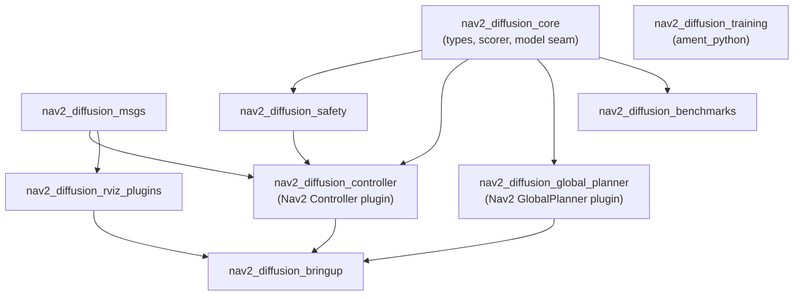

# Architecture

`Nav2PlannerBattle` のコアアーキテクチャ設計。安全 / 学習 / ベンチマーク / デプロイの詳細は専用ドキュメントに分割しています。

- 全体像と設計哲学: [../README.md](../README.md)
- Safety Architecture: [safety.md](safety.md)
- Training Architecture: [training.md](training.md)
- Benchmark Suite: [benchmarking.md](benchmarking.md)
- Simulation Strategy: [simulation.md](simulation.md)
- Deployment Strategy: [deployment.md](deployment.md)
- Roadmap: [roadmap.md](roadmap.md)
- Risks: [risks.md](risks.md)

---

## 0. Executive Summary

`Nav2PlannerBattle` は、Nav2 を置き換えるプロジェクトではない。Nav2 の既存アーキテクチャ、Behavior Tree、Lifecycle Node、Planner / Controller Plugin、Costmap、安全機構を最大限活かし、その上に Diffusion / Flow Matching / Consistency / Transformer / World Model 系の生成型ナビゲーションモデルを安全に接続するための OSS 基盤として設計する。

Nav2 はすでに、BT で複数のモジュラーサーバーをオーケストレーションし、Planner / Controller / Recovery 系プラグインを複数持てる構造を備えている。入力として TF、map、センサーデータ等を受け取り、最終的にモーター向けの速度指令を出す構成である。したがって本 OSS の勝ち筋は、Nav2 を fork することではなく、**Nav2 Native な plugin として「生成モデルが提案し、決定論的安全層が検証し、Nav2 が実行する」構造を作ること** にある。

重要な設計判断は、プロジェクト名は `Nav2PlannerBattle` であっても、最初の実用 MVP は **Nav2 Controller Plugin モード** を中心にすることだ。Nav2 において Planner Server は主にパス計画、Controller Server は局所環境での制御努力生成・パス追従・動的障害物回避を担うため、Future Trajectory Candidates、Best Trajectory、Velocity Commands を扱う本 OSS は、Nav2 Controller Server との親和性が最も高い。

---

## 1. Problem Statement

### 1.1 既存 Nav2 の強さ

Nav2 の既存スタックは非常に実用的である。Smac Planner は 2D A\*、Hybrid-A\*、State Lattice を提供し、ロボットタイプごとにコスト-aware かつ運動学的制約を考慮した経路生成が可能である。

Regulated Pure Pursuit はサービス・産業ロボット用途を意識した Controller で、曲率や障害物近接に応じて速度を調整する設計を持つ。MPPI Controller は候補軌道を評価し、critic や trajectory validator によって最適軌道の妥当性・衝突可能性を検証する構造を持つ。

つまり、Nav2 の問題は「古典手法だから弱い」ではない。むしろ、Nav2 は現在の ROS 2 移動ロボット開発における事実上の実用基盤であり、本 OSS はその上に乗るべきである。

### 1.2 既存 Nav2 で難しい領域

既存 Planner / Controller は、手設計されたコスト、局所最適化、探索、サンプリング、ヒューリスティックに基づくため、以下のような状況で限界が出やすい。

| 課題 | 典型症状 | なぜ難しいか |
|---|---|---|
| 人混み | 停止・譲りすぎ・割り込み失敗 | 人間の将来行動、暗黙の社会ルール、局所的な譲り合いをコスト関数だけで表現しにくい |
| 狭路 | 入口で振動、後退できない、U字罠 | 一時的にゴールから遠ざかる行動や複数モードの候補が必要 |
| 動的障害物 | 直前停止、再計画連発 | 未来予測と軌道候補の多様性が不足しやすい |
| 社会的ナビゲーション | 人の近くを不自然に通る | 距離だけでなく向き、速度、文脈、通行方向が関係する |
| センサーノイズ | 過剰反応、コストマップちらつき | 学習済み prior や時間文脈がないと不安定になりやすい |
| チューニング負荷 | robot ごとに critic / cost / inflation 調整 | 手設計パラメータが環境・速度・センサー・車体に強く依存する |

### 1.3 Generative Navigation が解くべき問題

生成モデルを Nav2 に入れる目的は、単に Diffusion を動かすことではない。目的は次の 4 つである。

1. **Multimodal Trajectory Generation** — 「右を抜ける」「左を抜ける」「一時停止して待つ」「一度下がる」など、複数の未来候補を同時に生成する。
2. **Learned Behavioral Prior** — 人間操作、実機ログ、シミュレーション、既存 Nav2 expert から、ロボットらしい・社会的に自然な・詰まりにくい行動 prior を学習する。
3. **Prediction-Aware Local Planning** — 現在の costmap だけでなく、短期未来の障害物・人・自車状態を考慮した軌道候補を出す。
4. **Nav2-Compatible Safety Execution** — 学習モデルの出力をそのまま信じず、Costmap、footprint、速度制約、Collision Monitor、fallback controller で検証してから実行する。Nav2 Collision Monitor は costmap や trajectory planner をバイパスして非常停止レベルの衝突監視を行う設計を持つため、本 OSS の安全層と強く相性が良い。

---

## 2. Vision: 3年後の理想像

### 2.1 Project Vision

3年後、`Nav2PlannerBattle` は以下の状態を目指す。

> **「Nav2 で生成型ナビゲーションを試すなら、まずこの OSS を使う」**

その状態とは、単一の Diffusion 実装があることではない。以下が揃っている状態である。

| 領域 | 3年後の理想像 |
|---|---|
| Nav2 統合 | 既存 Nav2 robot に plugin 差し替えで導入できる |
| モデル拡張 | Diffusion, Flow Matching, Consistency, Transformer, World Model を同じ枠組みで追加できる |
| 安全性 | 学習モデル出力は必ず deterministic safety gate を通る |
| 学習 | Gazebo, Isaac Sim, rosbag, teleop, expert planner から統一データセットを作れる |
| 推論 | Jetson / x86 / Edge GPU で現実的な周期で動く |
| Benchmark | MPPI / RPP / DWB / Smac 構成と再現可能に比較できる |
| DX | 30分で demo、1日で自分の robot、1週間で自社 bag 学習に進める |
| OSS | model zoo、benchmark leaderboard、model card、docs、CI が揃う |

### 2.2 Design Philosophy

> **Learned models propose. Classical safety disposes. Nav2 executes.**

生成モデルは候補を出す。安全層は候補を落とす。Nav2 は既存の運用基盤として実行する。

### 2.3 Research Context

Diffusion Policy は、ロボットの visuomotor policy を条件付き denoising diffusion process として扱い、複雑な行動分布やマルチモーダルな動作を表現できることを示した。NoMaD は、Transformer-based diffusion policy により、goal-directed navigation と goal-agnostic exploration を統合する方向性を示している。ViNT や GNM は、複数環境・複数ロボットからのデータを用いた汎用 visual navigation policy / foundation model の方向性を示している。LDP は local diffusion planner として、動的障害物や maze-like 構造での local navigation を条件付き分布問題として扱い、myopic observation や data diversity の課題を明確化している。

この OSS は、それらの研究を Nav2 ユーザーが実機・CI・benchmark・安全層込みで使える形へ翻訳する。

---

## 3. Core Architecture

### 3.1 System Overview

全体は 5 層に分ける。

| Layer | 役割 | 安定性 |
|---|---|---|
| Nav2 Integration Layer | Nav2 Planner / Controller / BT / Lifecycle / Costmap との接続 | 最も安定 |
| Observation & State Layer | Goal, Path, Costmap, LaserScan, PointCloud, Odometry, TF, Optional Camera の時系列整形 | 安定 |
| Generative Planning Core | Diffusion / Flow / Transformer / World Model による候補軌道生成 | 研究進化に応じて拡張 |
| Safety & Selection Layer | 軌道検証、衝突判定、速度制約、fallback、emergency stop 連携 | 最重要・安定 |
| Training / Benchmark / Model Zoo Layer | 学習、評価、再現性、モデル配布 | OSS 価値の源泉 |

### 3.2 Primary Integration Modes

#### Mode A: Controller Plugin Mode — v0.1 の主軸

Nav2 Controller Server 内で動作し、Global Path と Local Costmap を受け取り、未来軌道候補を生成し、Best Trajectory から `cmd_vel` を出す。

- **理由:** Nav2 で速度指令を生成する責務は Controller Server 側にある。動的障害物回避や局所環境での制御も Controller Server の責務として整理されているため、最初の OSS 価値を出しやすい。
- **v0.1 での推奨:** Costmap + Local Goal + Odometry + Global Path snippet を条件とする、camera optional ではない軽量モデル。

#### Mode B: Planner Plugin Mode — v1.0 以降

Nav2 Planner Server の plugin として、global path または中距離 subgoal sequence を生成する。

- **用途:** 狭路、U字罠、長い迂回、semantic prior が効く大域的判断。
- **注意:** Planner Server だけでは `cmd_vel` を出さない。Controller Plugin Mode と組み合わせる。

#### Mode C: Proposal-to-MPPI Mode — v0.5 以降

生成モデルが候補軌道分布を提案し、MPPI 風の critic / safety validator で選ぶ。

- **用途:** 既存 MPPI ユーザーに導入しやすい。生成モデルを「sampling prior」として使える。
- MPPI は optimal trajectory の publish、trajectory validator、critic 統計などのデバッグ・検証機構を持つため、このモードは Nav2 エコシステムへの説明責任を果たしやすい。

#### Mode D: Shadow Mode — 実機導入の必須段階

生成モデルは `cmd_vel` に影響しない。Nav2 標準 Controller がロボットを動かし、生成モデルは裏で候補軌道・best action・安全判定結果だけを記録する。

- **用途:** 実機での安全なデータ収集、model evaluation、deployment 前の risk assessment。

### 3.3 Core Components

| Component | 役割 |
|---|---|
| Nav2 Adapter | Controller / Planner plugin として Nav2 に接続する。Lifecycle, parameters, TF, costmap, diagnostics を扱う |
| Observation Builder | 複数入力を時刻同期し、モデルが使う egocentric 表現へ変換する |
| Context Encoder | Costmap, path, goal, velocity, optional camera / pointcloud をモデル条件へ変換する |
| Generative Trajectory Model | K 個の future trajectory candidates を生成する |
| Kinematic Projector | 候補軌道を差動二輪、omni、Ackermann などの制約に投影する |
| Safety Gate | footprint collision, velocity / acceleration / jerk, time-to-collision, stale data を検査する |
| Trajectory Scorer | progress, smoothness, clearance, path alignment, social cost, uncertainty を評価する |
| Command Extractor | Best Trajectory の先頭区間から `cmd_vel` を生成する |
| Fallback Manager | MPPI, RPP, rotate, stop, recovery への切替を管理する |
| Telemetry Recorder | 候補、棄却理由、latency、diagnostics、model hash を記録する |
| Benchmark Harness | 同一 scenario で MPPI 等と比較する |
| Model Registry | model card、manifest、runtime、input schema、benchmark 結果を管理する |

### 3.4 Non-Negotiable Architecture Rules

1. **Neural model が直接 `cmd_vel` を publish してはならない。** 必ず Safety Gate と Command Extractor を通す。
2. **Nav2 を fork しない。** Plugin、BT、Lifecycle、Costmap、Collision Monitor との統合で実現する。
3. **Costmap / TF / Odometry は runtime truth source として扱う。** モデルの内部表現が正しそうでも、実行時の Nav2 state と矛盾する軌道は棄却する。
4. **すべての候補軌道は可視化・記録できる。** 研究 OSS ではなく実運用 OSS にするため、RViz と rosbag で説明可能にする。
5. **GPU が死んでもロボットは安全に止まるか fallback する。**
6. **Camera は optional。** AMR / warehouse / delivery では LiDAR + costmap 構成が多いため、camera 必須にしない。
7. **Model Zoo のモデルは benchmark 通過済みでなければならない。**

---

## 4. Data Flow

### 4.1 End-to-End Flow

| Step | 入力 | 処理 | 出力 |
|---|---|---|---|
| 1. Goal Reception | Goal Pose / NavigateToPose | Nav2 BT が navigation task を開始 | active goal |
| 2. Global Context | map, global costmap, planner output | Global path または local goal を取得 | path snippet |
| 3. Local Observation | local costmap, LaserScan, PointCloud, odom, TF, optional camera | 時刻同期・座標変換・crop・正規化 | egocentric observation |
| 4. Generative Sampling | observation, goal, path, robot state | K 個の future trajectory candidates を生成 | candidate set |
| 5. Kinematic Projection | candidate set, robot limits | feasible motion envelope へ投影 | feasible-ish candidates |
| 6. Hard Safety Gate | costmap, footprint, collision monitor state, velocity limits | 衝突・制約違反・stale data を棄却 | safe candidate subset |
| 7. Soft Scoring | progress, path alignment, smoothness, clearance, social costs | best trajectory を選択 | best trajectory |
| 8. Command Extraction | best trajectory, current odom | 次の制御周期の `cmd_vel` を生成 | velocity command |
| 9. Runtime Monitoring | latency, diagnostics, safety state | timeout / OOD / invalid output を監視 | nominal / degraded / fallback |
| 10. Fallback | no safe candidate, GPU failure, sensor dropout | MPPI / RPP / stop / recovery へ移行 | safe behavior |

### 4.2 Input Contract

| Input | Required | 役割 |
|---|---|---|
| Goal | Yes | 最終目標または局所目標 |
| Global Path | Strongly recommended | 長期意図、myopic local minima 回避 |
| Local Costmap | Yes | 実行時の障害物・inflation・unknown handling |
| Occupancy Grid | Optional | global context / training / visualization |
| LaserScan | Recommended | raw obstacle evidence, costmap 補助 |
| PointCloud | Optional | 3D 障害物、倉庫棚、ガラス等への拡張 |
| Robot State | Yes | 現在姿勢、速度、frame 情報 |
| Odometry | Yes | command extraction と動的制約 |
| Camera | Optional | semantic / visual navigation / human-aware extension |
| Dynamic Tracks | Optional | 人・台車・フォークリフト等の予測入力 |

### 4.3 Output Contract

| Output | Consumer | 目的 |
|---|---|---|
| Future Trajectory Candidates | RViz, benchmark, safety layer | 候補の可視化・評価 |
| Best Trajectory | Command extractor, downstream controller | 実行予定軌道 |
| Velocity Commands | Nav2 / robot base | 実行制御 |
| Rejection Reasons | diagnostics, benchmark | なぜ候補が落ちたか |
| Safety State | BT / supervisor | fallback や stop 判断 |
| Model Telemetry | recorder / model registry | 再現性・品質管理 |

### 4.4 Trajectory Representation

内部表現は、直接 velocity 列ではなく、**time-indexed SE(2) trajectory candidate** を中心にする。

| 表現 | 長所 | 短所 | 採用方針 |
|---|---|---|---|
| cmd_vel 直接生成 | 低 latency | 安全検証・可視化・比較が難しい | 非推奨 |
| future pose sequence | 衝突判定・可視化・benchmark が容易 | command 変換が必要 | 主軸 |
| control sequence | dynamics と相性が良い | robot model 依存が強い | advanced mode |
| waypoint / subgoal | 長期判断に向く | 局所制御は別途必要 | planner mode |

---

## 5. Plugin Architecture

### 5.1 Plugin Design Goal

Plugin Architecture の目的は、Diffusion 専用 OSS にしないこと。将来の Flow Matching、Consistency Models、Transformer Planners、World Models を同じ Nav2 統合・安全・benchmark・training pipeline に載せることである。

Flow Matching は連続正規化フローの vector field 回帰として生成モデルを学習する枠組みであり、diffusion path を包含する方向性を持つ。Consistency Models は one-step / few-step generation を狙えるため、リアルタイム推論が重要なロボットにとって将来的に有望である。

### 5.2 Plugin Categories

| Plugin Category | 役割 | 例 |
|---|---|---|
| Nav2 Integration Plugin | Nav2 Controller / Planner として動作 | Controller mode, Planner mode |
| Observation Encoder Plugin | sensor 入力をモデル条件へ変換 | costmap-only, lidar, pointcloud, camera-BEV |
| Generative Model Plugin | 候補軌道を生成 | diffusion, flow, consistency, transformer |
| Runtime Backend Plugin | 推論エンジンを抽象化 | PyTorch dev, ONNX Runtime, TensorRT |
| Trajectory Scorer Plugin | soft cost を計算 | path alignment, clearance, social, comfort |
| Safety Filter Plugin | hard constraint を検査 | footprint collision, TTC, speed limit |
| Fallback Policy Plugin | 失敗時の動作 | stop, MPPI, RPP, rotate, recovery |
| Telemetry Plugin | ログ・可視化・benchmark | rosbag, trace, metrics |

### 5.3 Model Family Abstraction

| Model Family | 生成対象 | 強み | Runtime 課題 | Integration 方針 |
|---|---|---|---|---|
| Diffusion Planner | trajectory candidates | multimodal, complex behavior | iterative sampling latency | v0.1 主軸。ただし step 数を抑える |
| Flow Planner | trajectory flow / ODE rollout | sampling 効率、連続軌道 | solver 制御 | v1.0 以降 |
| Consistency Planner | one/few-step trajectory | edge GPU 向き | distillation 品質 | Jetson 向け v1.0 候補 |
| Transformer Planner | sequence / tokenized trajectory | 長期文脈、multi-modal input | OOD と latency | v0.5 以降 |
| World Model Planner | future observation / state rollout | 予測・what-if 評価 | heavy compute | v2.0 研究枠 |

### 5.4 Model Manifest

すべてのモデルは、コードとは別に manifest を持つ。

| Field | 内容 |
|---|---|
| model_name | モデル名 |
| model_family | diffusion / flow / consistency / transformer / world_model |
| input_modalities | costmap, odom, path, scan, pointcloud, camera 等 |
| output_type | trajectory candidates / subgoals / velocity sequence |
| frame_convention | base_link 基準か map 基準か |
| horizon | 予測秒数・trajectory 長 |
| robot_kinematics | diff / omni / ackermann / generic |
| speed_range | 想定速度範囲 |
| runtime | PyTorch / ONNX / TensorRT |
| precision | FP32 / FP16 / INT8 |
| training_data | dataset 名、sim/real 比率、robot 種類 |
| benchmark_results | pass/fail と主要 metrics |
| limitations | 使ってはいけない条件 |
| license | model/data/code を分離して明記 |
| checksum | artifact integrity |

### 5.5 Extension Rule

新モデルを追加する貢献者は、モデル本体だけでなく以下を提出する。

- model manifest
- model card
- 最小 demo
- benchmark 結果
- latency 結果
- safety gate 通過率
- 失敗例
- license 情報

これにより、GitHub Star を集める「研究デモ」ではなく、実際に使われる OSS になる。

---

## 7. Inference Architecture

> 学習（§6）は [training.md](training.md)、安全（§8）は [safety.md](safety.md) を参照。

### 7.1 Inference Principles

リアルタイム推論では、精度より先に **deadline, determinism, fallback** を設計する。

| Principle | 内容 |
|---|---|
| Deadline-aware | 制御周期を超えた出力は使わない |
| Async-first | GPU 推論と `cmd_vel` 制御を分離する |
| Last-safe-plan reuse | 新規推論が間に合わない時は直近安全軌道を短時間だけ再検証して使う |
| Stale rejection | 古い TF、古い costmap、古い sensor からの軌道は棄却 |
| Bounded memory | runtime 中に大きな動的確保をしない |
| Deterministic safety | model stochasticity は安全層で吸収 |
| Observable | latency、候補数、棄却理由を常時 diagnostics へ出す |

### 7.2 Runtime Backends

| Backend | 用途 |
|---|---|
| PyTorch | 研究・開発・training validation |
| ONNX Runtime | 標準推論・x86 / Jetson 両対応の中間形式 |
| TensorRT | Jetson / NVIDIA GPU 本番推論 |
| Triton | fleet / server-side evaluation / heavy model serving |
| CPU fallback | tiny model または model 無効時の安全 fallback |

ONNX Runtime の TensorRT Execution Provider は NVIDIA TensorRT を使って ONNX model を高速化するため、開発時の ONNX と本番時の TensorRT 最適化の橋渡しとして使える。TensorRT 自体は低 latency・高 throughput の production inference 向け最適化 runtime として提供されている。

### 7.3 Inference Modes

| Mode | 内容 | 用途 |
|---|---|---|
| Full Sampling | K 候補を diffusion sampling で生成 | benchmark / high quality |
| Few-step Sampling | DDIM / consistency / distilled model | real-time |
| Warm-start Sampling | 前周期の best trajectory を初期値に使う | smoothness |
| Proposal-only | 候補だけ生成し、別 scorer が選ぶ | MPPI hybrid |
| Shadow Inference | 出力を実行せず評価のみ | 実機 validation |
| Safe Stop Mode | 推論停止、`cmd_vel` zero | failure |

### 7.4 Runtime Gating

以下の条件で生成モデル出力を使わない。

| Condition | Action |
|---|---|
| inference deadline miss | previous safe trajectory 再検証、不可なら fallback |
| no safe candidate | fallback controller または stop |
| all candidates collide | stop / recovery |
| TF invalid | stop |
| costmap stale | stop または fallback |
| odom stale | stop |
| model confidence too low | fallback |
| OOD detector triggered | fallback |
| GPU memory error | fallback |
| NaN / invalid tensor | model disabled, fallback |

### 7.5 Profiling

推論系は平均 latency だけで評価しない。p95 / p99 / worst-case、callback delay、sensor-to-command latency を測る。ROS 2 には `ros2_tracing` があり、LTTng-UST を用いた低 overhead tracing が可能で、ROS 2 アプリケーションの trace / analysis にも使える。

---

## 12. Repository Structure

### パッケージ依存関係

> ランタイム（core / safety / controller）は軽量 C++ 依存のみ。学習（training）は ament_python で分離され、ロボットには載らない（§12.2）。

### 12.1 Top-Level Structure

ROS パッケージは役割別のサブディレクトリにまとめている（`generative/` /
`classical_planners/` / `reactive_controllers/` / `benchmarks/`）。colcon は再帰探索
するため、**パッケージ名・依存・import はディレクトリ位置に依存しない**（グルーピングは
可読性のためのもので、ビルドには無関係）。

| Path | 役割 |
|---|---|
| `/docs` | architecture, safety, benchmark, deployment, model cards |
| **`generative/`** | **生成ナビゲーション・フレームワーク（旧 `nav2_diffusion_*`）** |
| `generative/nav2_diffusion_core` | ROS 非依存に近い trajectory schema, scoring concept, shared utilities |
| `generative/nav2_diffusion_msgs` | trajectory candidates, diagnostics, benchmark result messages |
| `generative/nav2_diffusion_onnx` | optional ONNX Runtime backend implementing `TrajectoryModel` / `PathModel` (§7.2) |
| `generative/nav2_diffusion_safety` | safety gate, collision validation integration |
| `generative/nav2_diffusion_controller` | Nav2 Controller Plugin integration（Mode A）, `TrajectoryModel` seam |
| `generative/nav2_diffusion_global_planner` | Nav2 GlobalPlanner Plugin integration（Mode B）, `PathModel` seam（生成パス提案 → costmap 検証 → 最短安全パス選択） |
| `generative/nav2_diffusion_rviz_plugins` | candidate trajectory visualization |
| `generative/nav2_diffusion_training` | dataset, training, export pipeline（ament_python） |
| `generative/nav2_diffusion_bringup` | example launch/config for Nav2 + Gazebo mission harness |
| `generative/nav2_diffusion_sim` | closed-loop Gazebo obstacle-course assets（world/map/goals 単一生成） |
| **`classical_planners/`** | **Nav2 に無い classical GlobalPlanner 群（非AI）** |
| `classical_planners/nav2_rrt_planner` | サンプリングベース（RRT\* + RRT-Connect） |
| `classical_planners/nav2_prm_planner` | サンプリングベース（PRM ロードマップ + Dijkstra） |
| `classical_planners/nav2_dstar_lite_planner` | インクリメンタル探索（D\* Lite、変化セルのみ修復） |
| `classical_planners/nav2_jps_planner` | グリッド探索（JPS、対称性枝刈りで A\* 高速化） |
| `classical_planners/nav2_lazy_theta_star_planner` | any-angle（Lazy Theta\*、LOS 遅延）。upstream の eager Theta\* と別変種 |
| `classical_planners/nav2_ara_star_planner` | anytime（ARA\*、ε を下げ bounded-suboptimal 解を漸進改善） |
| `classical_planners/nav2_visibility_graph_planner` | 幾何（visibility graph、障害物凸コーナー + A\*） |
| **`reactive_controllers/`** | **Nav2 に無い reactive Controller 群（非AI、Mode A）** |
| `reactive_controllers/nav2_vfh_controller` | VFH+（極座標ヒストグラムで局所回避） |
| `reactive_controllers/nav2_nd_controller` | ND（gap 選択 + 安全偏向で局所回避） |
| **`benchmarks/`** | **オフライン比較ベンチ** |
| `benchmarks/nav2_planner_benchmarks` | classical + 生成 GlobalPlanner の同一シナリオ比較（経路長/pose/時間 → docs/planner_comparison.md） |
| `benchmarks/nav2_diffusion_benchmarks` | scenarios, metrics, reports |
| `/nav2_diffusion_models` | model manifest examples and lightweight test models |
| `/nav2_diffusion_tools` | rosbag conversion, model validation, report generation |
| `/model_zoo` | curated model card / manifest / artifacts |
| `/docker` | dev, benchmark, deployment containers |
| `/ci` | CI scripts and simulation regression configs |
| `/examples` | minimal demos, robot configs |
| `/model_zoo` | curated model metadata, not necessarily large binaries |
| `/rfcs` | design proposals and architecture decisions |

### 12.2 Runtime / Training Separation

OSS 失敗の典型は、runtime に研究用 Python 依存を入れすぎること。これを避ける。

| Area | Dependency Policy |
|---|---|
| Core runtime | ROS 2, Nav2, lightweight C++ dependencies |
| Inference runtime | optional ONNX / TensorRT / PyTorch adapter |
| Training | Python, PyTorch, dataset tools, experiment tracking |
| Simulation | optional Gazebo / Isaac Sim |
| Benchmark | optional but reproducible |
| Visualization | RViz plugin optional |

### 12.3 Documentation Structure

| Document | 内容 |
|---|---|
| README | 何ができるか、最短 demo、Nav2 との関係 |
| docs/architecture | 本ドキュメント |
| docs/safety | safety architecture, failure modes → [safety.md](safety.md) |
| docs/getting_started | Nav2 ユーザー向け導入 → [getting_started.md](getting_started.md) |
| docs/benchmarking | MPPI 比較の再現方法 → [benchmarking.md](benchmarking.md) |
| docs/training | bag から学習まで → [training.md](training.md) |
| docs/deployment_jetson | Jetson 最適化 → [deployment.md](deployment.md) |
| docs/model_zoo | model card 一覧 → [model_zoo.md](model_zoo.md) |
| docs/contributing | plugin 追加、model 追加、benchmark 追加 → [contributing.md](contributing.md) |
| docs/rfcs | 大きな設計変更の議論 → [../rfcs/](../rfcs/) |

### 12.4 CI/CD

| CI Type | 内容 |
|---|---|
| Lint | C++ / Python / docs |
| Build Matrix | supported ROS 2 distros |
| Unit Tests | observation, safety, scoring |
| Integration Tests | Nav2 bringup, plugin load, lifecycle |
| Simulation Tests | headless Gazebo |
| Benchmark Smoke | tiny scenario, tiny model |
| Model Artifact Tests | manifest, checksum, shape validation |
| GPU Nightly | TensorRT / ONNX Runtime |
| Docs Build | links, diagrams, tutorials |
| Security | unsafe model format, checksum, dependency scan |

---

## 15. Why This OSS Can Win

### 15.1 Nav2 ユーザーの既存資産を壊さない

Nav2 は production-grade な navigation framework として、perception、planning、control、localization、visualization などを提供し、多数の企業で使われている。そのため、新しい OSS が勝つには「Nav2 の代替」ではなく「Nav2 の能力拡張」になる必要がある。

`Nav2PlannerBattle` は、既存 Nav2 bringup、map、costmap、BT、controller server、collision monitor、RViz、rosbag をそのまま活かす。これは採用障壁を大きく下げる。

### 15.2 研究と実運用の谷を埋める

NoMaD、ViNT、GNM、LDP のような研究は魅力的だが、Nav2 ユーザーがそのまま倉庫 AMR やサービスロボットへ載せるには、plugin 化、安全層、benchmark、Jetson deployment、diagnostics、fallback が必要になる。

本 OSS は、論文モデルそのものではなく、**論文モデルを Nav2 で安全に試すための基盤** になる。

### 15.3 Diffusion 専用にしない

生成モデルの進化は速い。Diffusion だけに閉じると、Flow Matching、Consistency Models、Transformer Planner、World Models の波に遅れる。モデル family を plugin 化し、trajectory candidate contract、safety gate、benchmark を共通化することで、研究の進化を OSS 価値に変換できる。

### 15.4 Safety-first Generative Navigation という明確なポジション

生成モデルを移動ロボットに入れる最大の不安は安全性である。この OSS は最初から以下を前提にする。

- learned direct control ではなく trajectory proposal
- deterministic safety gate
- Nav2 Collision Monitor 連携
- fallback controller
- shadow mode
- model card
- benchmark

この設計思想は企業ユーザーにも研究者にも説明しやすい。

### 15.5 Benchmark が OSS の信頼を作る

GitHub Star を集めるには demo 動画が必要だが、実際に使われるには benchmark が必要である。MPPI、RPP、Smac 構成と公正に比較できる benchmark suite を最初から提供すれば、「面白い研究コード」ではなく「評価可能な navigation framework」になる。

### 15.6 Developer Experience で勝てる

勝つ OSS は、アルゴリズムだけでは勝たない。以下が揃っている OSS が勝つ。

| DX 要素 | なぜ重要か |
|---|---|
| 既存 Nav2 config への差し替え | 試用障壁が低い |
| RViz 可視化 | 挙動を理解できる |
| rosbag replay | 自社データで評価できる |
| Docker | install 失敗を減らす |
| model card | 使える条件が分かる |
| benchmark report | 社内説明できる |
| fallback demo | 実機 risk を下げる |
| Jetson guide | 現場導入に進める |
