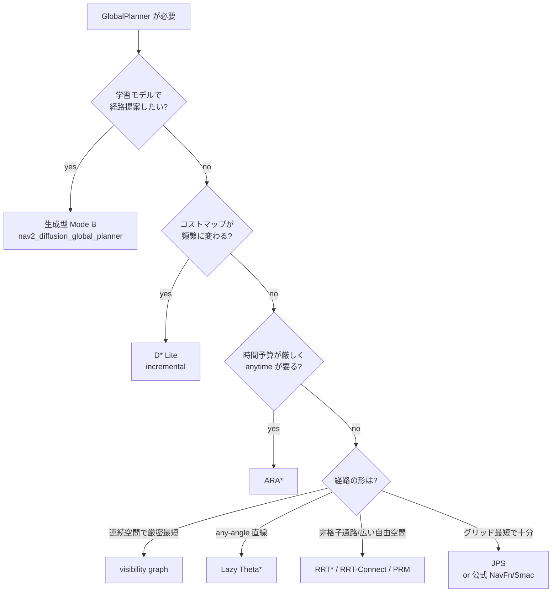
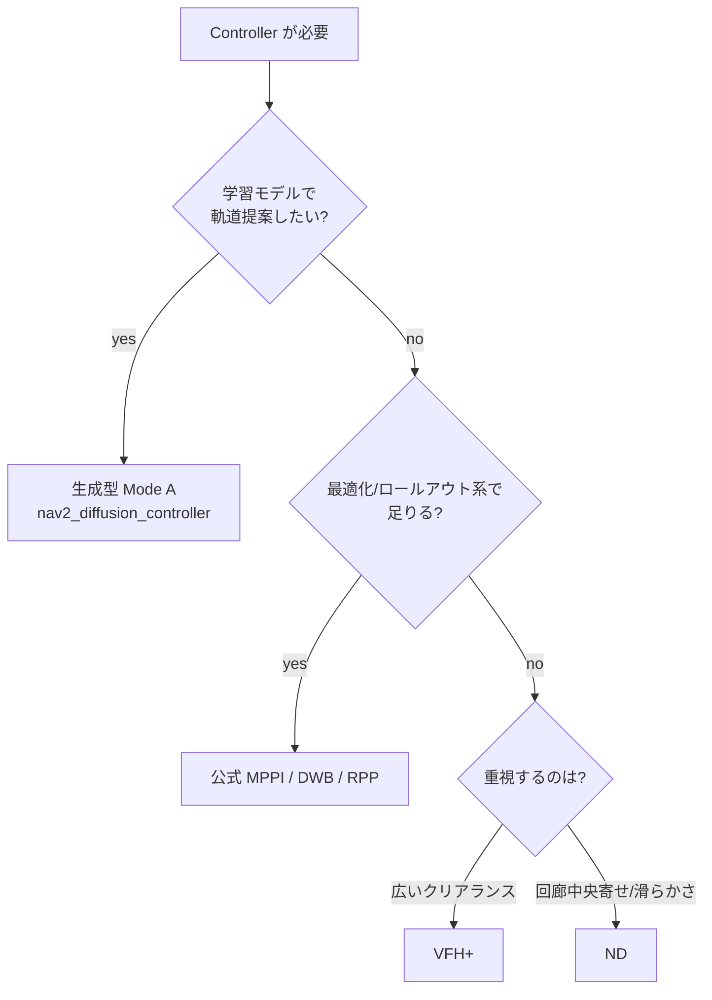

# どの planner / controller を使うか（選択ガイド）

`nav2_experimental_planner` は Nav2 公式に無い planner / controller を多数収録している。本ガイドはその中から**状況に応じてどれを選ぶか**の道標。実測の比較は [planner_comparison.md](planner_comparison.md)（classical GlobalPlanner 8 種 + 生成型 Mode B を同一土俵で比較）と [controller_comparison.md](controller_comparison.md)（reactive Controller 2 種）を参照。

> 大前提: これらは**実験的**実装で安全認証品ではない（[safety.md](safety.md)）。標準的な静的グリッド経路計画で十分なら、まず Nav2 公式の **NavFn / Smac**（global）や **MPPI / Regulated Pure Pursuit**（local）を使うこと。本リポジトリは、それらが**カバーしないパラダイム**が必要なときの選択肢を足すもの。

---

## 1. GlobalPlanner を選ぶ

### 判断軸

| 軸 | 問い |
|---|---|
| 最適性 | 最短経路が要るか、実行可能ならよいか |
| 計算予算 | 1 回の計画に割ける時間。広い地図か |
| 環境の動き | コストマップが頻繁に変わるか（動的障害物・逐次観測） |
| 表現 | グリッドで十分か、連続空間の幾何が要るか |
| 経路の滑らかさ | グリッド方向の階段でよいか、any-angle 直線が要るか |

### 状況別の推奨

| 状況 | 推奨 | 理由 |
|---|---|---|
| 標準的な静的地図・最短重視 | **Nav2 公式 NavFn / Smac**（or [JPS](../nav2_jps_planner)） | まず公式で十分。JPS は 8 連結 A\* と同じ最適経路を展開数大幅減で返す |
| 階段状を嫌い直線的な経路が欲しい | **[Lazy Theta\*](../nav2_lazy_theta_star_planner)** | any-angle。障害物の角でだけ曲がる |
| 障害物が少なく連続空間で厳密最短 | **[visibility graph](../nav2_visibility_graph_planner)** | コーナー間直線で幾何最短。コーナー数が多い地図は O(V²) に注意 |
| コストマップが少しずつ変わる・高頻度再計画 | **[D\* Lite](../nav2_dstar_lite_planner)** | 変化セルだけ修復する incremental。warm 再計画が安い |
| 時間予算が厳しく「まず妥当解→改善」 | **[ARA\*](../nav2_ara_star_planner)** | anytime。ε を下げて bounded-suboptimal を漸進改善 |
| 非格子的な通路・広い自由空間・将来の高次元化 | **[RRT\* / RRT-Connect](../nav2_rrt_planner)** | sampling。RRT-Connect は狭路を高速に貫通（feasible）、RRT\* は漸近最適 |
| 同一地図で多数の異なるクエリ | **[PRM](../nav2_prm_planner)** | ロードマップを再利用できる（本実装は plan ごと再構築だが将来 multi-query 向き） |
| 学習した経路分布で multimodal 提案＋安全層検証 | **[生成型 Mode B](../nav2_diffusion_global_planner)** | モデルが K 候補を提案、costmap が検証、最短安全パス選択。解析的 fan か、[model_zoo](../model_zoo/diffusion_global) の costmap 条件付き **学習済み** flow モデル（`OnnxPathModel`）を選べる |

### 決定フロー

---

## 2. Controller（local）を選ぶ

公式の **MPPI / DWB / Regulated Pure Pursuit**（最適化・軌道ロールアウト系）で足りるならそれを使う。本リポジトリは**反応的（reactive）**回避と**生成型**を足す。

| 状況 | 推奨 | 理由 |
|---|---|---|
| 軌道ロールアウト無しの安価な反応回避 | **[VFH+](../nav2_vfh_controller)** | 極座標ヒストグラムの free valley をコストで選ぶ。雑然空間で堅牢 |
| 狭い回廊での中央寄せ・すり抜けと滑らかな操舵 | **[ND](../nav2_nd_controller)** | gap 選択＋安全偏向。閉ループ比較では VFH+ より滑らか |
| 正面障害物に広いクリアランスで回避 | **[VFH+](../nav2_vfh_controller)** | 比較で frontal の最小クリアランスが大きい傾向 |
| 学習モデルで multimodal 軌道提案＋決定論安全層 | **[生成型 Mode A](../nav2_diffusion_controller)** | 提案→安全ゲート→scoring→cmd_vel、no-safe なら fallback |

VFH+ と ND は実測で「berth（VFH+ が広め）」対「smoothness（ND が滑らか）」のトレードオフで、**一方的な優劣は無い**（[controller_comparison.md](controller_comparison.md)）。

---

## 3. 共通の注意

- 全 planner は**決定論的**（sampling 系は `random_seed` 固定で再現可能）で、稼働中 `Costmap2DROS` に対する閉ループ統合テストを持つ（Gazebo/GPU 不要）。
- sampling / 二値グリッド系（JPS / Lazy Theta\* / visibility graph）は costmap を**二値（free/blocked）**として扱い、inflation の段階コストを無視する。ソフトなコスト整形が要るなら **D\* Lite**（`cost_weight`）や **ARA\***（`cost_weight`）、または公式 NavFn/Smac を使う。
- どの planner / controller も既存の Nav2 構成で **plugin を差し替えるだけ**で試せる（各パッケージ README と [../nav2_diffusion_bringup](../nav2_diffusion_bringup) の例 yaml）。

関連: [architecture.md](architecture.md) / [planner_comparison.md](planner_comparison.md) / [controller_comparison.md](controller_comparison.md)
