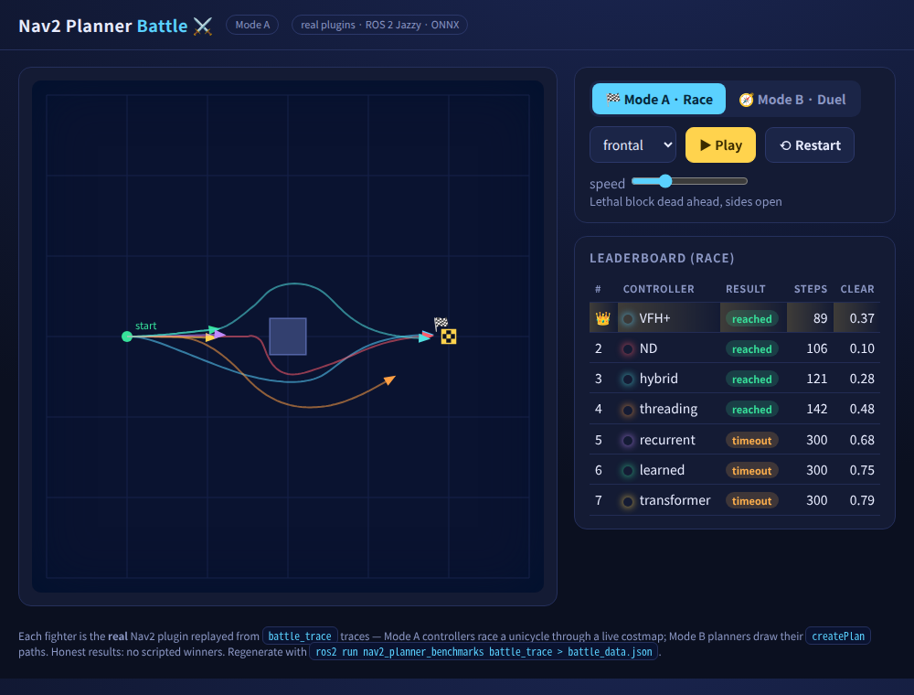

# Nav2 Planner Battle ⚔️

A browser battle game that replays the repo's **real** Nav2 planners and controllers
head-to-head. No scripted winners — every fighter is the actual plugin, replayed from
traces recorded by running it against a live `nav2_costmap_2d` costmap.



Two modes:

- **🏁 Mode A · Race** — the local `nav2_core::Controller` plugins (VFH+, ND, and the
  generative learned / transformer / recurrent / **threading** / hybrid Mode A models)
  race a unicycle through a shared arena, reacting to obstacles in closed loop. First to
  the goal wins; collisions explode 💥, timeouts stall. Watch the **threading** model
  thread the dead-ahead *frontal* block while the plain learned/transformer/recurrent
  models stall in front of it.
- **🧭 Mode B · Duel** — the global `nav2_core::GlobalPlanner` plugins (RRT*, RRT-Connect,
  PRM, D* Lite, JPS, Lazy Theta*, ARA*, Visibility graph, and the generative Mode B
  models) draw their `createPlan` paths simultaneously. Shortest valid path wins; the
  scoreboard also shows planning time.

## Play

**Online (GitHub Pages):** [https://rsasaki0109.github.io/Nav2PlannerBattle/](https://rsasaki0109.github.io/Nav2PlannerBattle/)

Or open `index.html` locally (no server needed — the data is loaded from `battle_data.js`):

```bash
xdg-open tools/nav2_planner_battle/index.html      # Linux
```

> **Pages setup (maintainers):** enable **Settings → Pages → Build and deployment →
> Source: GitHub Actions**. Pushes to `main` that touch `tools/nav2_planner_battle/`
> run [`.github/workflows/pages.yml`](../../.github/workflows/pages.yml) automatically.

Controls: pick a **scenario**, **▶ Play**, scrub **speed**, **⟲ Restart**, and toggle
**Mode A / Mode B / Championship**. While a race or duel plays, a **live HUD** on the arena
and extra leaderboard columns show steps, path length, distance to goal (Mode A), and
drawing path length + planning ms (Mode B) — the same numbers as the benchmark reports.
Two **micro mouse** mazes: **easy** (4×4, 1.5 m cells,
exploration run) and **hard** (8×8, 0.75 m cells, contest speed run) — SW start → centre
goal, inspired by All Japan MicroMouse.
**Championship** aggregates strength points across all scenarios — toggle **Race** (Mode A
controllers) or **Duel** (Mode B planners). Scoring: 1st=3, 2nd=2, 3rd=1 per scenario plus
a success bonus (+1 for goal reached / valid path).
Deep links freeze a frame for sharing, e.g.
[frontal block](https://rsasaki0109.github.io/Nav2PlannerBattle/?m=A&s=1&t=120),
[micro mouse easy](https://rsasaki0109.github.io/Nav2PlannerBattle/?m=A&s=4),
[Championship · Race](https://rsasaki0109.github.io/Nav2PlannerBattle/?m=C),
[Championship · Duel](https://rsasaki0109.github.io/Nav2PlannerBattle/?m=C&sub=B).

## Regenerate the data

The traces come from a small ROS 2 exporter that runs the real plugins:

```bash
# (build the workspace first; needs the onnxruntime prefix for the generative models)
ros2 run nav2_planner_benchmarks battle_trace > tools/nav2_planner_battle/battle_data.json
# wrap it for file:// loading (Chrome blocks fetch() of local files)
printf 'window.BATTLE_DATA = ' > tools/nav2_planner_battle/battle_data.js
cat tools/nav2_planner_battle/battle_data.json >> tools/nav2_planner_battle/battle_data.js
printf ';\n' >> tools/nav2_planner_battle/battle_data.js
```

`battle_trace` ([src](../../benchmarks/nav2_planner_benchmarks/src/battle_trace.cpp))
mirrors `controller_benchmark.cpp` / `planner_benchmark.cpp` exactly — it reports the
same real behaviour, only as JSON instead of Markdown. The Markdown reports remain the
canonical comparison ([docs/controller_comparison.md](../../docs/controller_comparison.md),
[docs/planner_comparison.md](../../docs/planner_comparison.md)).
